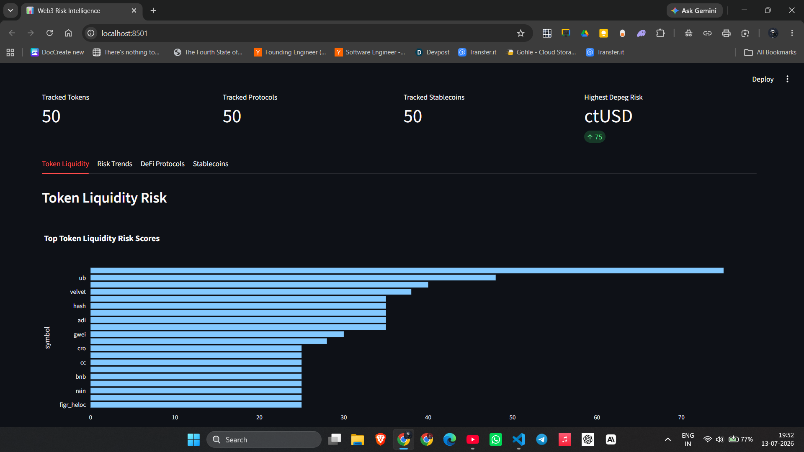

# Web3 Liquidity & On-Chain Risk Intelligence Platform

An end-to-end data engineering project that ingests crypto market data, DeFi
protocol metrics, and stablecoin data, then turns them into risk-oriented
analytics reports and an interactive dashboard.

## Why This Project Matters

Crypto and DeFi markets move quickly, but raw market data is noisy and fragmented
across exchanges, protocols, chains, and token systems. This project turns public
Web3 data into structured analytics that can help identify liquidity stress,
DeFi protocol drawdowns, and stablecoin depeg events.

## Dashboard Preview




## Project Goal

The goal is to build a real Web3 data platform that can monitor:

- Token liquidity risk
- Market volume anomalies
- DeFi protocol TVL risk
- Protocol drawdowns
- Stablecoin depeg risk
- On-chain risk signals in future phases

The project currently runs as a local batch pipeline and is designed to evolve
into a cloud-based batch and streaming platform.

## Current Features

- Ingests crypto market data from CoinGecko
- Ingests DeFi protocol TVL data from DefiLlama
- Ingests stablecoin supply and price data from DefiLlama
- Stores raw API responses as JSON
- Converts raw data into analytics-ready Parquet datasets
- Generates token liquidity risk reports
- Generates DeFi protocol risk reports
- Generates stablecoin depeg risk reports
- Generates stablecoin depeg trend reports after the second pipeline run
- Publishes unified risk observations with asset, score, factor, and run metadata
- Generates local risk alerts with optional webhook delivery
- Provides a separate fresh-snapshot risk sentinel for sudden price, TVL, and
  stablecoin peg shocks
- Builds a time-safe stablecoin forecast readiness report without claiming
  validation before enough history exists
- Runs pipeline quality checks
- Includes automated processor, analytics, and pipeline tests
- Provides an interactive Streamlit dashboard

## Data Sources

- CoinGecko Markets API
- DefiLlama Protocols API
- DefiLlama Stablecoins API

## Pipeline

```text
Public APIs
  -> Raw JSON landing zone
  -> Processed Parquet datasets
  -> DuckDB SQL analytics
  -> CSV risk reports
  -> Unified risk observations
  -> Optional risk alerts
  -> Optional high-frequency risk sentinel
  -> Forecast readiness and calibrated forecast output
  -> Streamlit dashboard
  -> Run manifest and quality checks
```

## Architecture

See [docs/architecture.md](docs/architecture.md) for the detailed local,
cloud, and streaming architecture.

```text
src/
  ingestion/     Fetch raw data from public APIs
  processing/    Normalize raw JSON into Parquet datasets
  analytics/     Generate risk reports using DuckDB SQL
  dashboard/     Streamlit dashboard
  quality/       Pipeline output validation

data/
  raw/           Raw API payloads
  processed/     Clean analytics-ready Parquet files

reports/         Generated analytics outputs
```

## Risk Metrics

### Token Liquidity Risk

The token liquidity risk score considers:

- Volume-to-market-cap ratio
- 24-hour price drawdown
- 7-day price drawdown
- Circulating supply completeness

### DeFi Protocol Risk

The protocol risk score considers:

- Total value locked
- 1-day TVL change
- 7-day TVL change
- Audit availability

### Stablecoin Depeg Risk

The stablecoin depeg risk score considers:

- Price deviation from USD peg
- 1-day supply contraction
- 7-day supply contraction
- Chain availability

## Generated Reports

The pipeline generates:

```text
reports/token_liquidity_risk_top50.csv
reports/token_liquidity_risk_trends.csv
reports/defi_protocol_risk_top50.csv
reports/defi_protocol_risk_trends.csv
reports/stablecoin_depeg_risk_top50.csv
reports/stablecoin_depeg_risk_trends.csv
reports/risk_alerts_latest.csv
reports/stablecoin_forecast_readiness.json
reports/stablecoin_forecast_latest.csv
```

These files are ignored by git because they are generated outputs.

## Example Outputs

Small sample outputs are committed under `examples/` so reviewers can inspect the
report shape without running the pipeline:

```text
examples/token_liquidity_risk_sample.csv
examples/token_liquidity_risk_trends_sample.csv
examples/defi_protocol_risk_sample.csv
examples/defi_protocol_risk_trends_sample.csv
examples/stablecoin_depeg_risk_sample.csv
examples/stablecoin_depeg_risk_trends_sample.csv
```

## How To Run

Create and activate a virtual environment:

```powershell
python -m venv .venv
.\.venv\Scripts\activate
```

Install dependencies:

```powershell
pip install -r requirements.txt
```

Run the full pipeline:

```powershell
python src\run_pipeline.py
```

Run the dashboard:

```powershell
streamlit run src\dashboard\app.py
```

## Quality Checks

The pipeline validates that processed datasets and latest reports exist, are not
empty, and contain expected risk score columns. Trend reports are schema-checked
and may be empty until a second snapshot is available.

```powershell
python src\quality\check_outputs.py
```

Run the automated tests with:

```powershell
python -m pytest
```

The first pipeline run creates the latest reports and schema-valid empty trend
reports. Trend rows appear automatically after the next run, when two processed
snapshots are available for comparison.

Each run also writes a manifest under `data/runs/` and a unified observation
table at `data/processed/risk_observations_latest.parquet`. Set
`RISK_ALERT_WEBHOOK_URL` before running the pipeline to send alerts to a
compatible JSON webhook. `RISK_ALERT_MIN_SCORE` defaults to 50 and
`RISK_ALERT_MIN_SCORE_CHANGE` defaults to 10. Leave the webhook unset for
local-only alert files.

Run the separate sentinel path when the batch cadence is not frequent enough:

```powershell
python -m src.monitoring.risk_sentinel
```

The sentinel writes `reports/risk_sentinel_latest.json` atomically and can send
threshold-crossing events to `RISK_SENTINEL_WEBHOOK_URL`. It is designed for a
short schedule such as every few minutes. Notification state suppresses
duplicate webhook deliveries while still publishing the full current event
set. It does not replace the historical batch pipeline.

The forecast path is included in the full pipeline. It labels future stablecoin
depeg events from later snapshots, evaluates whether the history is sufficient,
and writes `insufficient_data` until the minimum history and event coverage are
available. It will not publish forecast probabilities in that state.

## Deployment

The local-to-cloud deployment path, artifact contract, scheduling model, and
required service permissions are documented in
[docs/deployment.md](docs/deployment.md). No cloud credentials are required to
run the local pipeline or its tests.

The repository also includes a non-mutating GCP deployment plan:

```powershell
.\scripts\deploy_gcp.ps1 -Plan -ProjectId YOUR_PROJECT_ID -BucketName YOUR_BUCKET
```

## Portfolio Highlights

This project demonstrates:

- API ingestion
- Raw-to-processed data modeling
- Parquet-based local data lake design
- DuckDB analytics
- Risk scoring logic
- Data quality checks
- Dashboard development
- Git/GitHub workflow
- A path toward cloud deployment and streaming data

## Future Extensions

- Add real-time exchange trade ingestion
- Add on-chain wallet and token transfer data
